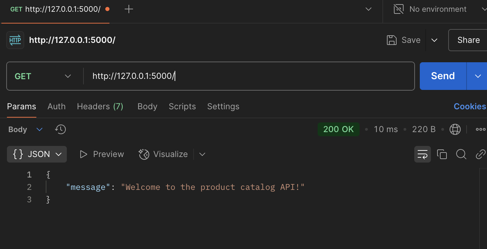
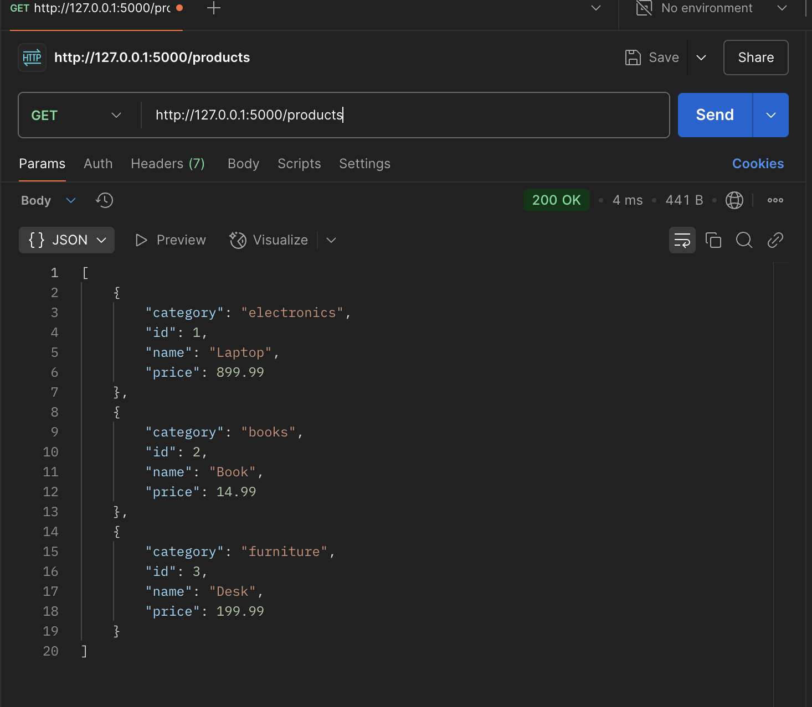
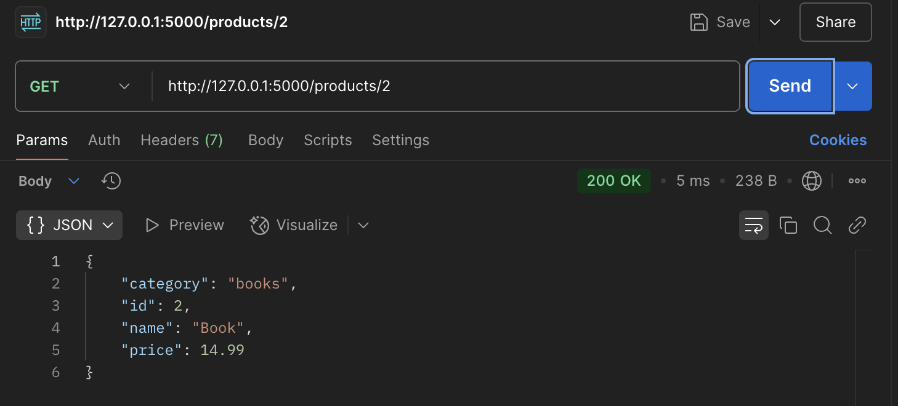
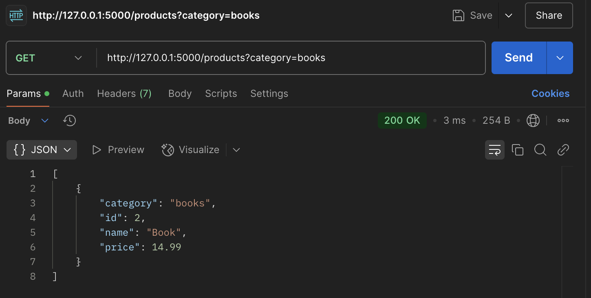
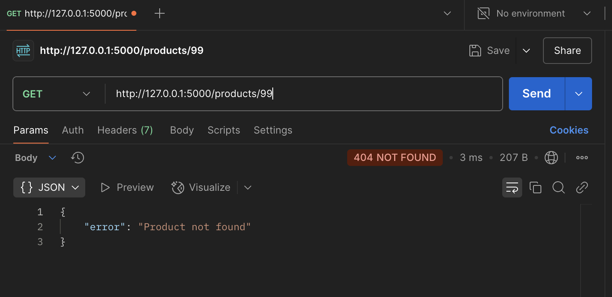

# Module Lab: Building RESTful GET APIs with Flask

## Learning Goals

- Implement RESTful API endpoints using Flask.
- Handle HTTP GET methods to serve resource data.
- Support query parameters and dynamic route segments.
- Return consistent JSON responses using `jsonify()`.
- Follow RESTful conventions in route structure and response formatting.

## Introduction

In this lab, you will build a **Read-Only RESTful API** to serve a list of products. The API will allow users to:

- Access a homepage route with a welcome message
- Retrieve all products via `GET /products`
- Fetch a specific product using `GET /products/<id>`
- Filter products by category using a query string (`/products?category=books`)

You’ll simulate a product catalog using an in-memory list of dictionaries, format all responses as JSON, and follow best practices for route design and error handling.

## Setup Instructions

### Fork and Clone the Repository

1. Go to the provided GitHub repository link.
2. Fork the repository to your GitHub account.
3. Clone the forked repository to your local machine:

```bash
git clone <repo-url>
cd course-8-module-4-get-api-flask
```

### Install Dependencies

Ensure Python is installed:

```bash
python --version
```

Install Flask and dependencies using pipenv:

```bash
pipenv install
pipenv shell
```

Or with pip:

```bash
pip install flask
```

## Tasks

### Task 1: Define the Problem

You’re building a basic product catalog API. It should:

- Display a welcome message at `/`
- Serve all products with `GET /products`
- Retrieve individual products via `GET /products/<id>`
- Filter products by category using a query string (e.g. `/products?category=books`)

---

### Task 2: Determine the Design

The Flask API should:

- Use `@app.route()` decorators with `methods=["GET"]`
- Use `request.args.get()` to handle query parameters
- Return all output using `jsonify()`
- Return meaningful HTTP status codes (`200`, `404`)

---

### Task 3: Develop the Code

Create `app.py` and start with the following structure:

```python
from flask import Flask, jsonify, request

app = Flask(__name__)

# Mock data
products = [
    {"id": 1, "name": "Laptop", "price": 899.99, "category": "electronics"},
    {"id": 2, "name": "Book", "price": 14.99, "category": "books"},
    {"id": 3, "name": "Desk", "price": 199.99, "category": "furniture"},
]

# TODO: Implement homepage route that returns a welcome message
# TODO: Implement GET /products route that returns all products or filters by category
# TODO: Implement GET /products/<id> route that returns a product by ID or 404

if __name__ == "__main__":
    app.run(debug=True)
```

---

### Task 4: Test the API

Start the Flask development server:

```bash
python app.py
```

Test your endpoints using your browser, Postman, or curl:

- `GET http://localhost:5000/`
- `GET http://localhost:5000/products`
- `GET http://localhost:5000/products/2`
- `GET http://localhost:5000/products?category=books`

---

## Best Practices

- Use plural nouns for collection routes (e.g., `/products`)
- Normalize input (e.g., `.lower()`) when filtering by query string
- Use `jsonify()` for all responses
- Return:
  - `200 OK` for successful GET requests
  - `404 Not Found` if a product ID doesn’t exist
- Include inline comments to explain your logic

---

## Considerations

**1. Input Validation**

- Handle invalid query parameters or IDs with a clear error message.

**2. Case Sensitivity in Filtering**

- Normalize both category input and stored data to avoid mismatches.

**3. Consistent Response Structure**

- Ensure all responses follow the same JSON format.

**4. Modular Code**

- Keep logic clean and organized. As your API grows, consider separating routes into blueprints and data into separate modules.

---

## Conclusion

After completing this lab, you will:

✅ Understand RESTful GET route structure  
✅ Build routes that serve both collections and single resources  
✅ Use query strings to filter results  
✅ Return structured JSON and meaningful HTTP responses

This lays the foundation for full CRUD APIs in the next module.

## Overview

This project implements a **Read-Only RESTful API** using Python and Flask. The API serves a fictional product catalog and demonstrates:

- Handling `GET` requests
- Using route parameters and query strings
- Returning consistent JSON responses
- Following RESTful conventions

---

## API Routes

- `GET /` – Welcome message
- `GET /products` – List all products
- `GET /products?category=books` – Filter products by category
- `GET /products/<id>` – Get a single product by ID

## Endpoints

### Base



### All Products



### One Product



### Book Category



### Not Found


